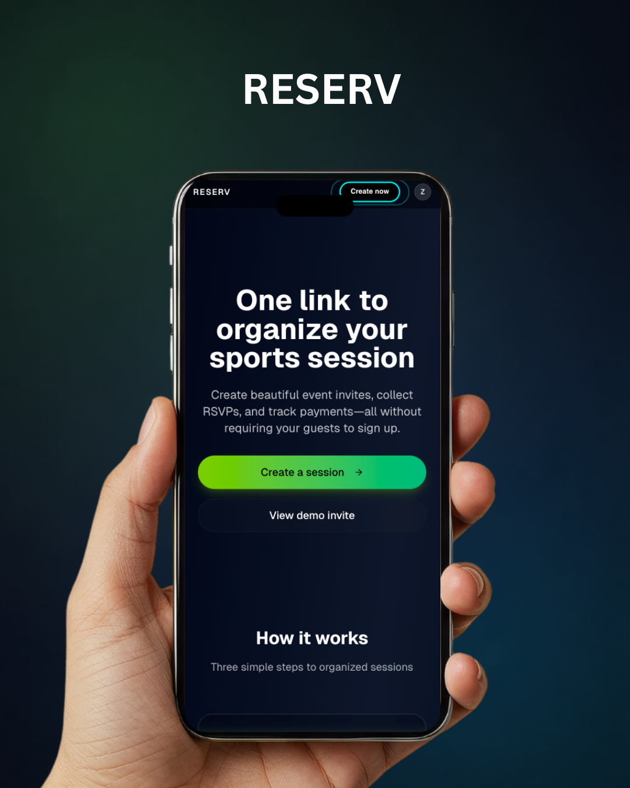
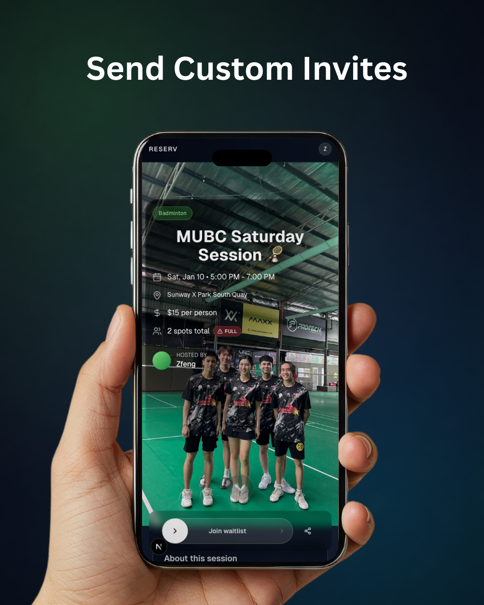
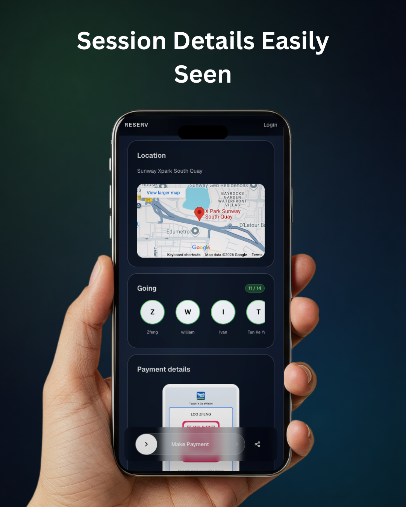
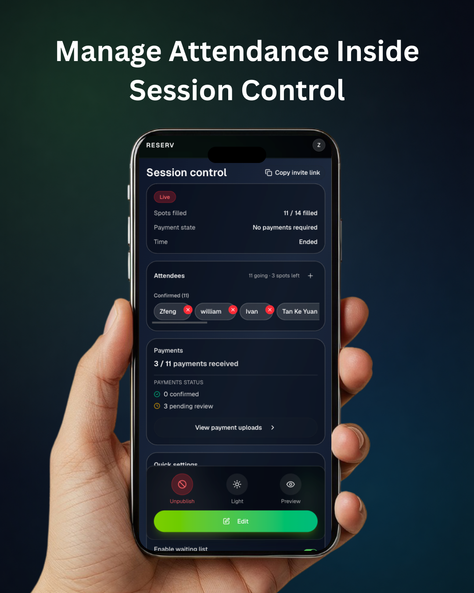
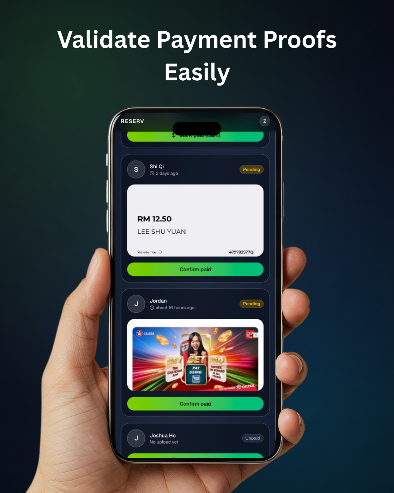
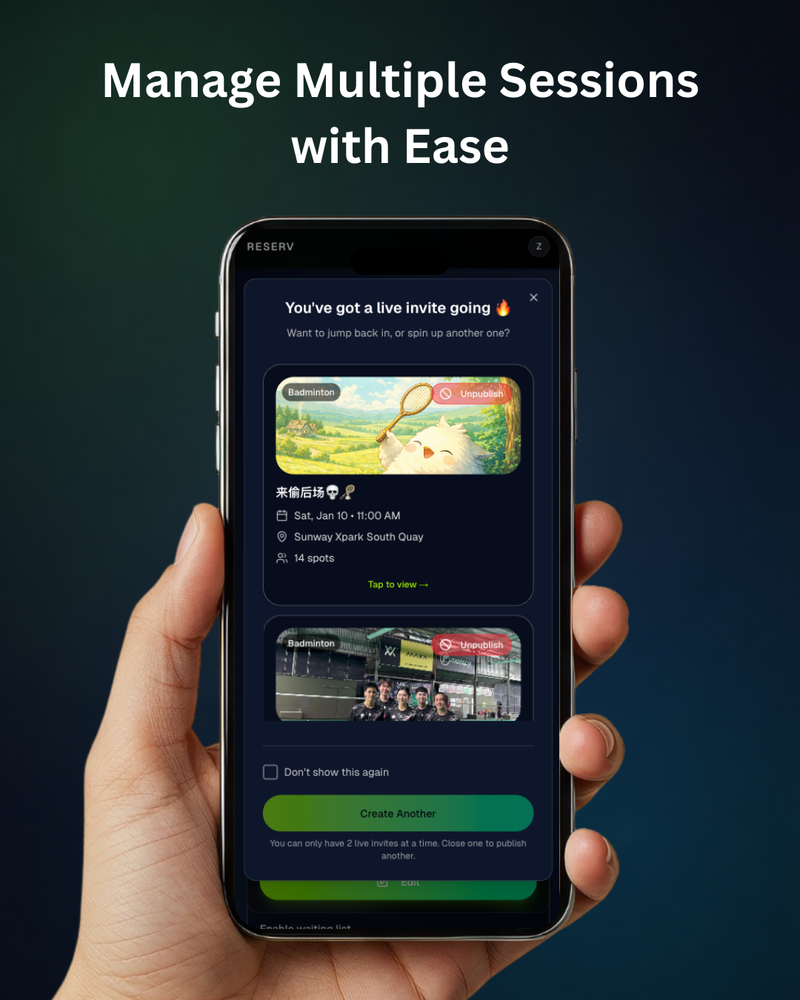

## RESERV

**One link to organize your sports session.** Create beautiful invites, collect RSVPs, and track payments — without requiring your guests to sign up.

### Screenshots

| Landing | Customize template |
| --- | --- |
|  |  |

| Invite page | Share invite |
| --- | --- |
|  |  |

| Session details | Host control |
| --- | --- |
|  |  |

| Payment proof upload | Multiple Sessions |
| --- | --- |
|  |  |


### What you can do

- **Create a session**: Set details, capacity, pricing, and payment instructions.
- **Share one link**: Guests can RSVP quickly (no account required).
- **Track attendance + payments**: See status at a glance; guests can upload proof of payment.

### Tech stack

- **Next.js (App Router)** + **React** + **TypeScript**
- **Supabase** (Auth, Postgres, Storage, Edge Functions)
- **Tailwind CSS** + **shadcn/ui** (Radix UI primitives)

### Technical walkthrough (how it’s implemented)

RESERV is built around a simple model: **hosts publish one public invite link**, guests RSVP without accounts, and hosts review attendance + payments.

#### 1) Routes & rendering strategy (Next.js App Router)

- **Landing**: `app/page.tsx`
- **Host session creator**: `app/host/sessions/new/edit/page.tsx`
- **Host session editor / analytics**: `app/host/sessions/[id]/edit/page.tsx`
- **Public invite (canonical share URL)**: `app/[hostSlug]/[code]/page.tsx`
  - URL format: `/{hostSlug}/{publicCode}`
  - Generates OpenGraph/Twitter metadata for WhatsApp/iMessage previews
- **Public session by id**: `app/session/[id]/page.tsx`
  - Redirects authenticated hosts to their edit/analytics view
- **Shared session page**: `app/s/[code]/page.tsx` (uses the route param as the session id)
- **Join API**: `app/api/join/route.ts` (`POST`)

Most pages use server-side Supabase reads (SSR/RSC) and render dynamically to show the latest RSVP/payment state.

#### 2) Supabase clients (SSR vs anon vs admin)

Supabase wiring lives in `lib/supabase/server/server.ts`:

- **`createClient()`**: cookie-aware SSR client (auth works server-side)
- **`createAnonymousClient()`**: truly anonymous client (doesn’t refresh sessions; avoids stale-cookie refresh issues)
- **`createAdminClient()`**: service-role client for privileged server-only operations

#### 3) Core data model

The MVP flows revolve around:

- **`sessions`**: session metadata + publish state (`status`, `public_code`, `host_slug`, capacity, waitlist flag, payment instructions)
- **`participants`**: RSVP list + waitlist (`status`, `display_name`, `guest_key`, etc.)
- **`payment_proofs`**: payment review pipeline
  - `payment_status` (`pending_review` / `approved` / `rejected`)
  - `proof_image_url` (Supabase Storage public URL)
  - **`covered_participant_ids`** (JSONB array) so one upload can cover multiple participants

There are also host-only tables like **`session_drafts`** and **`host_settings`**.

#### 4) Security model (RLS-first)

RLS is enabled and enforced in migrations under `supabase/migrations/`.

- **Public session reads**: anon can only `SELECT` sessions where `status = 'open'`
  - See `supabase/migrations/20251231154752_enable_rls_sessions.sql`
- **Participant inserts**: anon/authenticated can insert participants for open sessions
  - See `supabase/migrations/20250114000000_fix_participants_insert_rls.sql`

For sensitive writes that still need to work for guests (not logged in), RESERV performs **server-side validation** and then uses the **service role** to write safely.

#### 5) Guest RSVP / join flow (idempotent + capacity-aware)

Guests RSVP via `POST /api/join` (`app/api/join/route.ts`):

- Validates inputs: `publicCode`, `name`, `guestKey`
- Loads the session (must be `status = 'open'`)
- Checks capacity; if full and **waitlist is enabled**, joins as `waitlisted`
- Writes via admin client for reliability after validation
- Handles duplicate joins gracefully (same `guest_key` → treated as already joined)

Guest “identity” uses a localStorage key (`lib/guest-key.ts`) so multiple guests can join from the same device without overwriting each other.

#### 5.1) Publishing + share links

Publishing is implemented as a server action in `app/host/sessions/[id]/actions.ts` (`publishSession()`):

- Generates a unique `public_code` (short code)
- Derives a canonical `host_slug` from the host name
- Transitions `sessions.status` from `draft` → `open`
- Enforces a product constraint: **max 2 live sessions per host**

Client-side share links use `lib/invite-url.ts` to format the canonical URL `/{hostSlug}/{publicCode}` and invoke the Web Share API (with clipboard fallback).

#### 6) Payment proof upload flow (guest)

Guests can upload payment proof via `submitPaymentProof()` in `app/session/[id]/actions.ts`:

- Client submits a base64-encoded image (receipt / transfer screenshot)
- Server uploads it to Supabase Storage bucket **`payment-proofs`**
- Server inserts a `payment_proofs` row with:
  - `payment_status = 'pending_review'`
  - `proof_image_url = <public url>`
  - `covered_participant_ids = [{ participant_id: ... }, ...]`

Storage policies for the `payment-proofs` bucket are defined in:
`supabase/migrations/20250108000000_create_payment_proofs_storage_bucket.sql`

#### 7) Host payment review + analytics

Host-side analytics and payment review live in `app/host/sessions/[id]/actions.ts`:

- `getSessionAnalytics()` aggregates attendance + payment totals
- `getPaymentUploadsForSession()` joins participants with their most recent proof (including covered participants)
- `confirmParticipantPaid()` marks a proof as `approved`
- `markParticipantPaidByCash()` creates an approved “cash” payment record without an image

#### 7.1) Waitlist promotion

When a confirmed participant is removed, the host flow can automatically promote the earliest waitlisted participant if capacity allows (server-side to avoid races). This logic lives in `app/host/sessions/[id]/actions.ts`.

#### 8) Optional: auto-unpublish expired sessions

`supabase/functions/auto-unpublish/` is an Edge Function that can delete published sessions **48 hours after end time**, via an RPC (hard delete cascades remove participants + payment proofs). It’s designed to run on a cron schedule.

### Local development

1. Install dependencies:

```bash
pnpm install
```

2. Create `.env.local`:

```bash
# Supabase
NEXT_PUBLIC_SUPABASE_URL=https://your-project.supabase.co
NEXT_PUBLIC_SUPABASE_ANON_KEY=your-anon-key
SUPABASE_SERVICE_ROLE_KEY=your-service-role-key

# Optional
NEXT_PUBLIC_SITE_URL=http://localhost:3000
NEXT_PUBLIC_DEBUG_LOGS=true
```

3. Set up Supabase (once):

- Create a Supabase project and apply the SQL migrations in `supabase/migrations/`.
- Create a **public** Storage bucket named **`payment-proofs`** (required for payment upload screenshots and flows).

4. Start the dev server:

```bash
pnpm dev
```

Then open `http://localhost:3000`, or view the demo invite at `http://localhost:3000/demo/invite`.

For more detailed environment notes (including production setup), see `archive/ENV_SETUP.md`.
